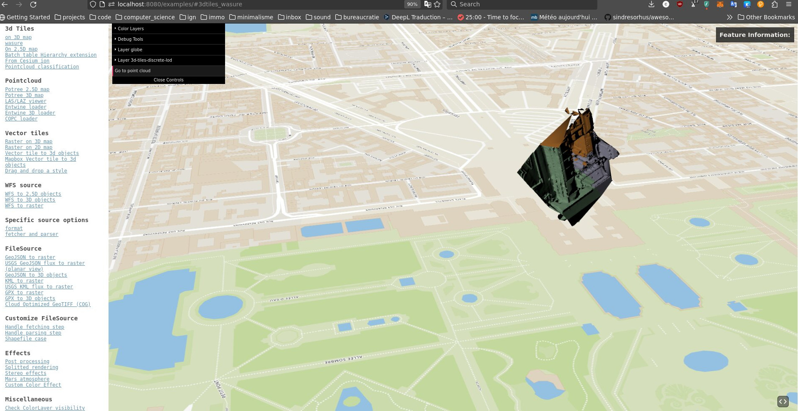

# minimal-python-project

A first draft to create a 3D tiles struct from a tiled mesh/
Does not work actually.

3D tiles specs
https://github.com/CesiumGS/3d-tiles

## Install
conda env create --file=environments.yml
conda activate mesh23Dtile

## Run example 
To run the example, just run 
```console
./run_example.sh
```
in the main dir, it will creates the output in the "output" 

## On lidar hd
A minimal example on lidar HD stored in './datas/lidar_hd_crop/'
The result is created in  './output_lidarhd_crop/'
```console
./run_lidarhd.sh
```
Notes : 

LiDARHD laz file are in epsg:2154 coordinate system.
The resulting mesh is shifted for numerical stability
(coords="635471.0x6856430.0" in the lidar_hd.sh file)
There is actually two mode : 
- mode_proj=0 that convert obj file in b3dm and add a 4x4 transformation matrix in the tileset.json
- mode_proj=1 that first convert obj in epsg:4979 and write the bouiding volume as region in epsg:4978 coordinates

The result with mode_proj is actually buggy, need some help! :

## TODO
☐ Solve rotation issue 
## Note
- Read Itowns js stuff by Gerald : https://github.com/LIDAR-HD-IGN/PointsTools/tree/main/src
- Read https://github.com/pka/awesome-3d-tiles

- convert obj to gltf 
  - https://github.com/arcplus/ObjConvert
  - https://github.com/VCityTeam/py3dtilers/tree/master
	- https://github.com/VCityTeam/py3dtilers/tree/master/py3dtilers/ObjTiler#obj-tiler
